# Zusammenfassung Datenbanken

---

Von: Sebastian Klinger, Benno Rodehack


---

## Inhalt

[1. Phasen der Entwicklung einer Datenbank](#1-phasen-der-entwicklung-einer-datenbank)

    [1.1 Externe Phase/Anforderungsanalyse](#11-externe-phaseanforderungsanalyse)

    [1.2 Konzeptionelle Phase](#11-externe-phaseanforderungsanalyse)

        [ER-Modell](#er-modell)

        [Beispiel eines ER-Modells](#beispiel-eines-er-modells)

        [Kardinalitäten](#kardinalitaten)

    [1.3 Logische Phase](#13-logische-phase)

    [1.4 Verfeinerung des logischen Modells](#14-verfeinerung-des-logischen-modells)

    [1.5 Physische Phase](#15-physische-phase)

[2. SQL (Structured Query Language)](#2-sql-structured-query-language)

    [2.1 DDL (Data Definition Language)](#21-ddl-data-definition-language)

        [`CREATE`](#create-befehl)

        [Variablen](#variablen-und-der-set-befehl)

        [`DROP`](#drop-befehl)

        [`ALTER`](#alter-befehl)

    [2.2 DML (Data Manipulation Language)](#22-dml-data-manipulation-language)

        [`INSERT`](#insert-befehl)

        [`UPDATE`](#update-befehl)

        [`DELETE`](#delete-befehl)

    [2.3 DQL (Data Query Language)](#23-dql-data-query-language)

        [`SELECT`](#select-befehl)

        [`WHERE`](#where-befehl)

        [`JOIN`](#join-befehl)

    [2.4 DCL (Data Control Language)](#24-dcl-data-control-language)

        [`CREATE USER`](#create-user-befehl)    

        [`GRANT`](#grant-befehl)

        [`REVOKE`](#revoke-befehl)

        [`SHOW GRANTS`](#show-grants-befehl)

        [`DROP USER`](#drop-user-befehl)

        [`FLUSH PRIVILEGES`](#flush-privileges-befehl)

    [Nützliche Befehle](#nutzliche-befehle)

        [`USE`](#use-befehl)

        [`SHOW`](#show-befehl)

        [`EXPLAIN`](#explain-befehl)

[3. ANSI-SPARC Architektur](#3-ansi-sparc-architektur)

    [3.1 Geschichte](#31-geschichte)

    [3.2 Diagramm](#32-diagramm)

    [3.3 Vorteile des Drei-EbenenModells](#33-vorteile-des-drei-ebenen-modells)

    [3.3 Nachteile des Drei-Ebenen-Modells](#33-nachteile-des-drei-ebenen-modells)

[4. RDBMS](#4-rdbms-relational-database-management-system)

    [4.1 Begriffe](#41-begriffe)

    [4.2  Aufbau](#42-aufbau)

[5. Einrichtung von Mysql auf Ubuntu Server 22.04 LTS](#5-einrichtung-von-mysql-auf-ubuntu-server-2204-lts)

    

## 1. Phasen der Entwicklung einer Datenbank

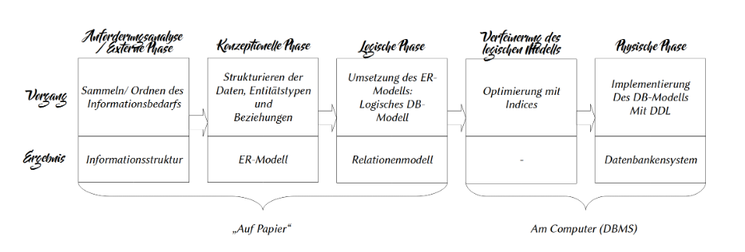

---

### 1.1 Externe Phase/Anforderungsanalyse

In dieser Phase sammelt man den Informationsbedarf (IST/SOLL Analyse) und Ordnet ihn.

### 1.2 Konzptionelle Phase

#### ER-Modell

Ein ER Modell wird meistens genutzt um Datenkardinalitäten zu veranschaulichen.

#### Beispiel eines ER-Modells

In jeder Tabelle stellt jede Reihe Eine Entität dar. Die Zusammenfassung von mehreren Reihen ist eine Entitätsmenge. Jede Spalte ist ein Attribut.

Tabelle Item:

Hier ist der Entitätstyp Item

| I_ID | Name                | ItemType_ID | Screenshot (als String)                                                                                           | IsRandomlyRolled | TierType_ID |
| ---- | ------------------- | ----------- | ----------------------------------------------------------------------------------------------------------------- | ---------------- | ----------- |
| 1    | Eyasluna            | 9           |                                      | true             | 5           |
| 2    | The Time-Worn Spire | 13          |                                        | true             | 5           |
| 3    | Edge of Intent      | 33          |                                       | true             | 5           |
| 4    | Fighting Lion       | 23          |                                     | false            | 6           |
| 5    | Starfire Protocol   | 28          |  | false            | 6           |

Tabelle ItemType (Ausschnitt):

Hier ist der Entitätstyp ItemType

| ItemType_ID | Name             |
| ----------- | ---------------- |
| 9           | Hand Cannon      |
| 13          | Pulse Rifle      |
| 33          | Glaive           |
| 23          | Grenade Launcher |
| 28          | Chestplate       |

Tabelle TierType (Ausschnitt):

Hier ist der Entitätstyp TierType

| TierType_ID | Name      |
| ----------- | --------- |
| 5           | Legendary |
| 6           | Exotic    |

#### Kardinalitäten

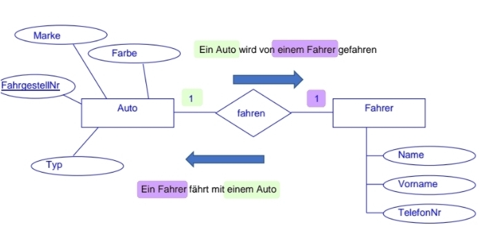

Erklärung:

Verb:

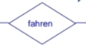

Fahren stellt hier das "Verb" dar, als was genau die Beziehung zwischen den Tabellen darstellt. Die Striche die von der Raute in der Mitte weggehen stellen die Eigentlichen Kardinalitäten dar.

Entitätstyp:


Hier ist der Entitätstyp ein Auto. Die "1" auf der Rechten Seite stellt die Beziehung zum anderen Entitätstyp "Fahrer". Da ein Auto von **einem** Fahrer gefahren wird ist diese Beziehung eine 1:1 Beziehung.

Attribut:


Die Marke stellt hier ein Attribut von einem Auto dar.

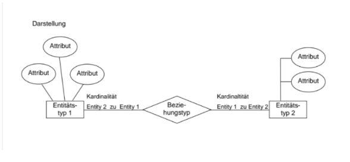

Weitere Beispiele:

M:N Beziehung:

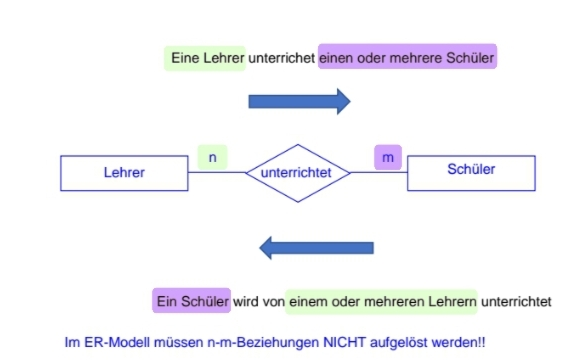

1:N Beziehung

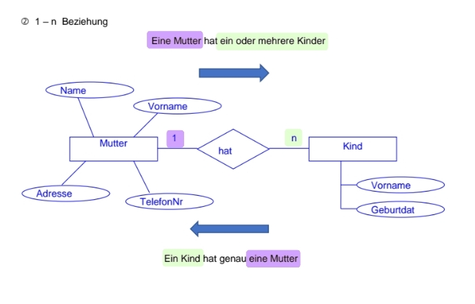

### 1.3 Logische Phase

In der Logischen Phase wird das ER-Modell in ein Logisches Datenbankmodell umgewandelt. Ein logisches Datenbankmodell legt die Struktur von Datenelementen und ihre Beziehungen untereinander fest. Es ist unabhängig von der physischen Datenbank, die detailliert beschreibt, wie die Daten implementiert werden.

Beispiel:

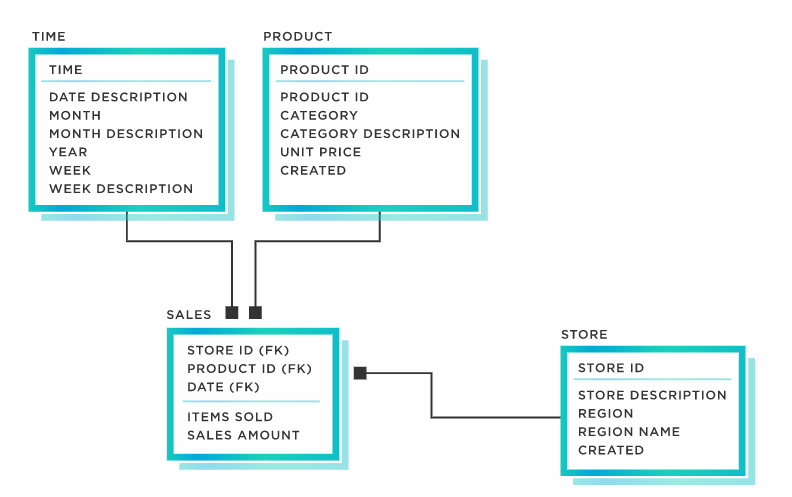

### 1.4 Verfeinerung des logischen Modells

In dieser Phase wird das Logische Modell aus dem Schritt vorher genommen und optimiert (in der hinsicht auf Datenredundanzen etc.)

### 1.5 Physische Phase

In dieser Phase wird das DB-Modell mit der **D**ata**D**efinition**L**anguage (DDL) implementiert

---

## 2 SQL (**S**tructured Query Language)

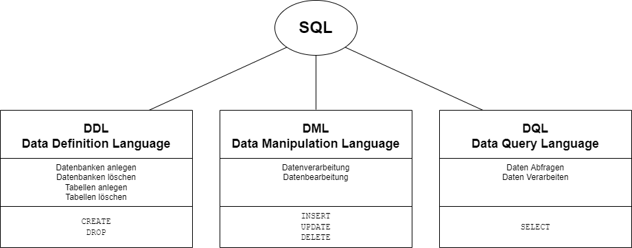

--- 

### 2.1 DDL (Data Definition Language)

Die DDL ist ein Teil der Structured Query Language und Ermöglicht die Datenstrukturen(Datenbanken, Tabellen) zu beschreiben, zu ändern oder zu entfernen.

##### ``CREATE`` Befehl

Dieser Befehl wird für das Anlegen von Datenbanken oder Tabellen.

```sql
CREATE DATABASE IF NOT EXISTS Beispiel;
```

1. Das Schlüsselwort ``CREATE`` zeigt dem Parser das etwas erstellt werden soll

2. Das Schlüsselwort ``DATABASE`` zeigt an das eine Datenbank erstellt werden soll

3. ``IF NOT EXISTS`` zeigt an das die Datenbank nur dann erstellt werden soll wenn sie nicht existiert

4. ``Beispiel`` steht für den Namen der Datenbank, er sollte eindeutig sein

##### Variablen und der `SET` Befehl

```sql
SET @db= 'Beispiel';
```

Das Schlüsselwort ``SET`` zeigt dem Parser das eine neue Variable mit dem namen "db" (das @ muss vorhanden sein)

Diese kann dann im weiteren verlauf der Query ablaufen.

##### `DROP` Befehl

```sql
DROP DATABASE Beispiel;
```

1. `Drop`zeigt hier an das etwas gelöscht werden muss

2. `Database` zeigt dem Parser das eine Datenbank gemeint ist

3. `Beispiel` ist der Name der zu löschenden Datenbank

##### `ALTER` Befehl

```sql
ALTER TABLE Item (1), (2), (3);
```

1. `ALTER` zeigt das eine vorhandene Tabelle oder Datenbank geändert werden soll

2. `TABLE` = Tabelle

3. `Item` = Name der Tabelle (siehe oben unter 1.2)

### 2.2 DML (Data Manipulation Language)

Die DML (Data Manipulation Language) ist ein Teil der SQL-Sprache, die sich mit allen Auswahl-/Einfüge-/Änderungs- und Löschoperationen beschäftigt. Besonders bei Auswahloperationen kann man enorme Unterschiede feststellen, die sich in ihrer Antwortgeschwindigkeit widerspiegeln.

#### `INSERT` Befehl

Ein Befehl um Datensätze zu erstellen

```sql
INSERT INTO Item (I_ID, Name, Screenshot) VALUES (6, 'Phoenix Protocol', 'https://www.bungie.net/common/destiny2_content/screenshots/4057299719.jpg');
```

##### `UPDATE` Befehl

Ein Befehl um Datensätze zu verändern

```sql
UPDATE Item SET ItemType_ID = '28' AND TierType = '6' AND IsRandomlyRolled = 'false' WHERE I_ID = '10';
```

##### `DELETE` Befehl

Ein Befehl um Datensätze zu löschen

```sql
DELETE FROM Item WHERE I_ID = '10';
```

Wenn alle Datensätze aus einer Tabelle gelöscht werden sollen kann auch einfach nur:

```sql
DELETE FROM Item;
```

genutzt werden

#### 2.3 DQL (Data Query Language)

Hin und wieder taucht auch eine eigene Kategorie Data Query Language (DQL) für die Abfrage von Daten auf. Diese Einteilung ist jedoch, auf Grund der nicht vorhandenen Standardisierung, nicht allgemein anerkannt.

##### `SELECT` Befehl

Der Simpelste Select Befehl der über eine Tabelle geht und diese ausgibt sieht so aus:

```sql
SELECT * FROM Item;
```

##### `WHERE` Befehl

Um Datensätze zu filtern wird die "Where" clause genutzt

```sql
SELECT * FROM Item WHERE I_ID = 10;
```

##### `JOIN` Befehl

Um mehrere Tabellen miteinander zu verknüpfen kann ein Join Befehl genutzt werden

Inner Join:


Ein Inner Join wird genutzt um nur die Datenstätze auszugeben die in beiden Tabellen vorhanden sind

```sql
SELECT * FROM Item
    INNER JOIN ItemTyp ON ItemTyp.ItemType_ID = Item.I_ID
WHERE Item.I_ID = "10";
```

Wenn mehrere Felder mit gleichem namen vorkommen in den Tabellen die Verknüpft werden, muss mit TabellenName.SpaltenName gearbeitet werden damit der Parser weiß welche Spalte gemeint ist.

# 

`LEFT JOIN` und `RIGHT JOIN`

Left Join:

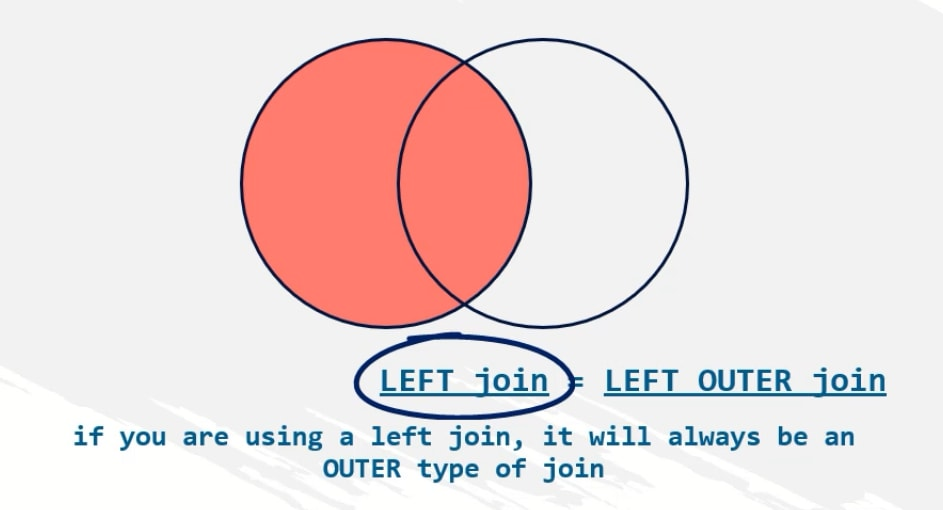

Right Join:


Ein Left oder Right Join wird auch zum verknüpfen von Tabellen genutzt. 

```sql
SELECT * FROM Item 
    LEFT JOIN ItemType ON ItemTyp.ItemType_ID = Item.I_ID
WHERE Item.I_ID = "10";
```

#### 2.4 DCL (Data Control Language)

Die DCL (Data Control Language) ist der letzte Teil der Sprache SQL, welche die Berechtigungsvergabe von Lese- und Schreibrechten gewährleistet. Die Nachvolgenden Befehle sollten auf dem Server mit Root Rechten ausgeführt werden.

##### `CREATE USER` Befehl

```sql
CREATE USER 'username'@'erlaubter_host' IDENTIFIED BY 'password';
```

Hier mit wird ein neuer User erstellt der mit dem Passwort 'password' authentifiziert wird. Wenn jeder host erlaubt werden soll kann '%' als wildcard benutzt werden.

##### `GRANT` Befehl

```sql
GRANT CREATE, ALTER, DROP, INSERT, UPDATE, DELETE, SELECT, REFERENCES, RELOAD on db_name.table_name TO 'username'@'erlaubter_host' WITH GRANT OPTION;
```

Hier mit werden dem ausgewählten User die Rechte CREATE, ALTER, DROP, INSERT, UPDATE, DELETE, SELECT , REFERENCES, RELOAD gegeben.

Alternativ kann einem User auch alle Berechtigungen(Admin) geben werden:

```sql
GRANT ALL PRIVILEGES ON db_name.table_name TO 'username'@'erlaubter_host' WITH GRANT OPTION
```

Wenn der User für alle Tabellen  und Datenbanken Admin berechtigungen haben soll dann kann statt db_name und table_name auch ein '*' genutzt werden

##### `REVOKE` Befehl

```sql
REVOKE type_of_permission ON db_name.table_name FROM 'username'@'erlaubter_host'
```

Hiermit wird dem user das Recht wieder entzogen.

##### `SHOW GRANTS` Befehl

```sql
SHOW GRANTS FOR 'username'@'erlaubter_host';
```

Hiermit wird angezeigt welche Recht ein User im Moment hat

##### `DROP USER` Befehl

```sql
DROP USER 'username'@'erlaubter_host';
```

Hiermit wird der User wieder gelöscht und hat keinen zugriff mehr auf die Datenbank

##### !!!`FLUSH PRIVILEGES` Befehl!!!

```sql
FLUSH PRIVILEGES;
```

Dieser Befehl ist besonders wichtig, da er die Privilegien Tabelle neu lädt. Dieser Befehl sollte vor allem nach dem erstellen oder ändern von Nutzern ausgeführt werden.

#### Nützliche Befehle

##### `USE` Befehl

```sql
USE db_name
```

Wechselt in die angegebene Datenbank

##### `SHOW` Befehl

```sql
SHOW TABLES; 
SHOW Databases;
```

Zeigt je nach Befehl alle vorhandenen Tabellen oder Datenbanken an

##### `EXPLAIN` Befehl

```sql
EXPLAIN Item;
```

Gibt detailliert an wie die Tabelle/Datenbank aufgebaut ist (Datentypen, etc.)

---

## 3 ANSI-SPARC-Architektur

### 3.1 Geschichte

Die ANSI-SPARC-Architektur wurde 1975 vom Standards Planning und Requirements Committee (SPARC) des American National Standards Institute ins Leben gerufen und hat dasd Ziel den Benutzer einer Datenbank vor nachteiligen Auswirkung von Änderungen in der Datenbankstruktur zu schützen ([ANSI-SPARC-Architektur – Wikipedia](siehe auch Wikipedia))

### 3.2 Diagramm

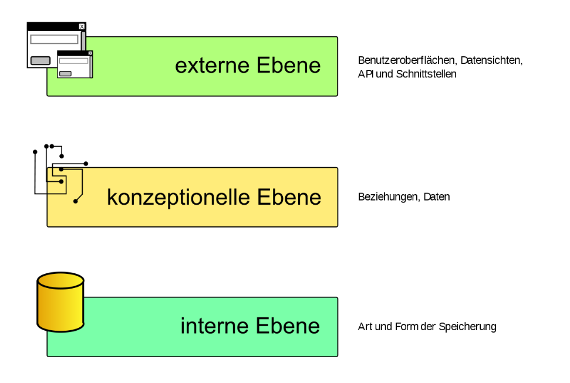

---

### 3.3 Vorteile des Drei-Ebenen-Modells

- Physische Datenunabhängigkeit: Die Interne Ebene ist von der konzeptionellen und externen Ebene getrennt. Physische Änderungen, z.B. des Speichermediums (Festplatten, etc.) oder des Datenbankprodukts (Mysql, Mariadb, Oracle DB, etc.) wirken sich nicht auf die konzeptionelle oder externe Ebene aus.

- Logische Datenunabhängigkeit: Die konzeptionelle und die externe Ebene sind getrennt, was bedeutet dass änderungen an der Datenbankstruktur (konzeptionelle Ebene, Zweite Ebene) keine Auswirkungen auf die externe Ebene, also die Masken-Layouts, Listen und APIs haben

All diese Mechanismen sind dafür gedacht um das gesamte System robuster und fehler toleranter zu machen. Es lässt sich auch sagen das wenn eine Ebene nicht richtig funktioniert werden die Daten meist nicht verändert oder gehen nicht verloren. 

### 3.4 Nachteile des Drei-Ebenen-Modells

- Komplexität: Durch die Drei Ebenen muss viel zwischen den Ebenen kommuniziert werden, was bedeutet das mehr Fehler beim Endnutzer und auch schon in der Entwicklung von neuen Produkten auftreten können

---

## 4 RDBMS (Relational Database Management System)

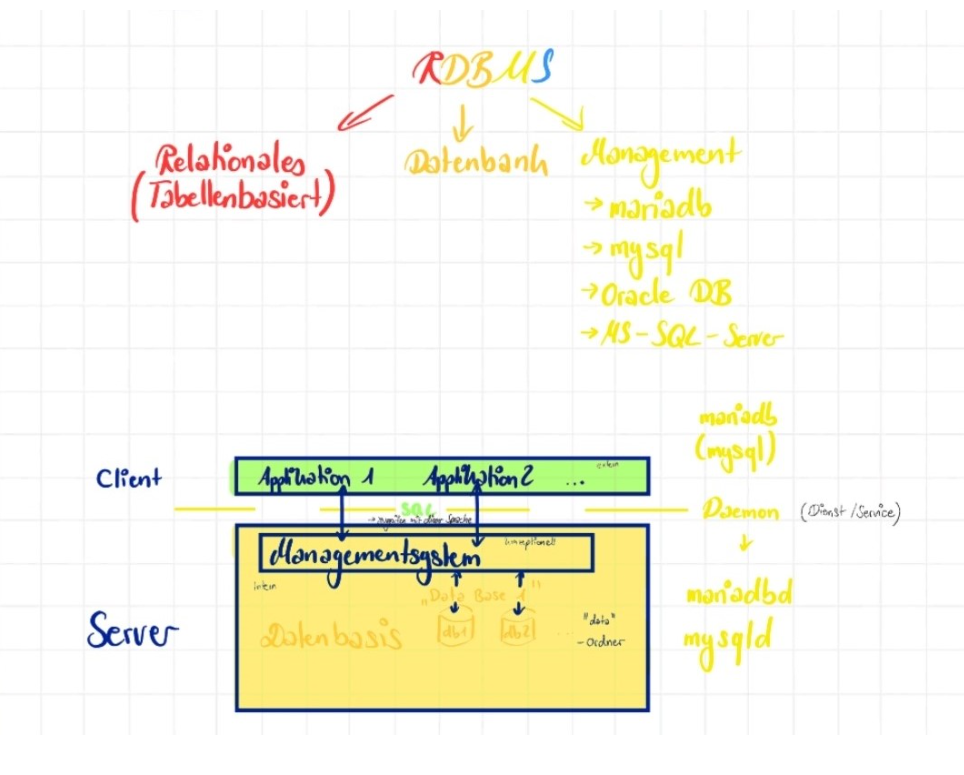

---

### 4.1 Begriffe

R: Relationales (Tabellenbasiert)

D: Datenbank (Database)

M: Management (Management System wie bsp. mariadb, mysql, Oracle DB, Microsoft SQL Server)

S: System

### 4.2 Aufbau

Wie im Diagramm oben zu sehen ist ist das RDBMS in mehrere Teile (größtenteils Server und Client) aufgebaut. Der Server ist das System, dass tatsächlich die Datenbank und dsa RDBMS beinhaltet. Der Client kann z.B. auf der selben physischen Maschine laufen, sendet dann anfragen an die Server Applikation und erhält so Daten die für die Verarbeitung in der Applikation am Client benötigt werden. Allternativ kann der Client auch in einem anderen Netzwerk stehen und eine Anfrage an den Server schicken, sollte dieser konfiguriert sein das Anfragen aus dem Netz erhalten und verarbeitet werden.

## 5 Einrichtung von Mysql auf Ubuntu Server 22.04 LTS

In dieser Sektion wird erklärt wie man einen Mysql Server auf einem Ubuntu Server 22.04 LTS Jammy Jellyfish aufsetzt.

Zuerst muss das System geupdated werden:

```shell-session
$ sudo apt-get update && sudo apt-get upgrade
```

Dann werden die benötigten Pakete Installiert:

```shell-session
$ sudo apt-get install mysql-server tmux
```

Standardmäßig sollte jetzt schon der Server laufen. Das kann mit diesem Command getestet werden:

```shell-session
$ sudo systemctl status mysql
```

Falls der Server im Netzwerk verfügbar sein soll muss die Config Datei des Servers geändert werden. In der Datei in /etc/mysql/mysql.conf.d/mysqld.cnf muss der punkt bind-address auf die IP der Maschine geändert werden:

```shell-session
$ sudo nano /etc/mysql/mysql.conf.d/mysqld.cnf
```

Ungefähr so etwas steht in der Datei:

```shellsession
...
bind-address            = 127.0.0.1
mysqlx-bind-address     = 127.0.0.1
...
```

Das muss zu etwas so ähnlichem geändert werden:

```
...
bind-address              = 1.1.1.1
mysqlx-bind-address       = 127.0.0.1
...
```

Dann muss der Server neugestartet werden:

```shell-session
$ sudo systemctl restart mysql
```

Jetzt kann der Server benutzt werden:

```shell-session
$ sudo mysql -u root
mysql> SELECT....
```
